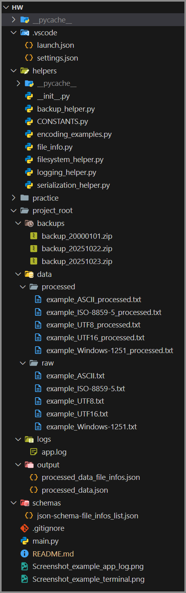
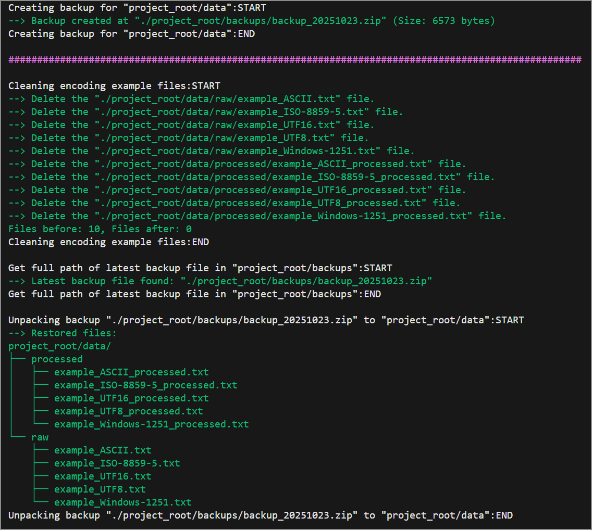
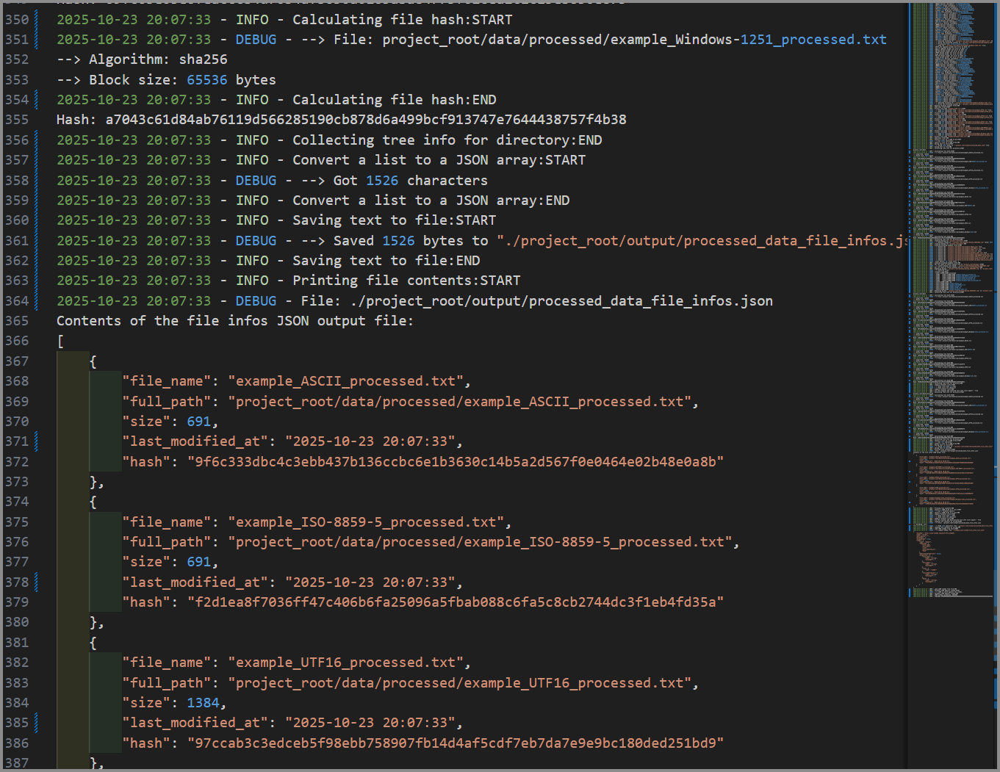

# AIU-Python-L12-HW
Python-разработчик | #12 | Работа с файлами, с операционной системой и путями. Кодировки, сериализация данных, json

----
----
----

# В этот .PDF файл экспортирован весь процесс отладочного выполнения всех скриптов:<br/>[**``./Terminal_Output.pdf``**](./Terminal_Output.pdf)

----
----
----

# Полное дерево проекта:<br/>  

----
----
----


# Отчёт о выполнении

## 1. Общие замечания. Общая информация.

- Всё опубликовано в GitHub в public GIT Repository с [множеством comit-ов](https://github.com/YuriAbele/AIU-Python-L12-HW/commits/main/)
- проект содержит [**``.gitignore``**](./.gitignore) настроенный для **``Python``**
- VSCode [настроен](./.vscode/launch.json) для запуска на отладку по **``F5``** файла [**``./main.py``**](./main.py)
- VSCode [настроен](./.vscode/settings.json) для для валидации JSON схемы при открытии файлов [**``*_file_infos.json``**](./project_root/output/processed_data_file_infos.json)
  - сама JSON Schema лежит в [**``./schemas/json-schema-file_infos_list.json``**](./schemas/json-schema-file_infos_list.json)
- Все макрометоды содержат для отладки сообщение о старте и окончании, а так же какие-то промежуточные сообщения.<br/>
  Пример вывода в терминал:<br/>
  
- Вся работа всего решения выводится в консоль и записывается в лог файл [**``./project_root/logs/app.log``**](./project_root/logs/app.log)<br/>
  VSCode показывает этот лог более красочно:<br/>
  

### 2. Суммарно во всём проекте использованны следующие Python пакеты:

```py
import os
from pathlib import Path
import shutil
from datetime import datetime
import chardet
import hashlib
import json
from jsonschema import validate, ValidationError
import logging
from colorama import Fore, Back, Style, init as colorama_init
```


### 3. Был создан **``helpers``** пакет со своим [**``__init__.py``**](./helpers/__init__.py). В этом пакете:

- **``CONSTANTS.py``** - это не хэлпер а файл с константами, чтобы:
    - избежать **<i>"magic constants"</i>**
    - соблюсти принцип **SPOT** (**S**ingle **P**oint **o**f **T**ruth)

- **``LoggingHelper``**
    - для упрощения вывода сообщения отладки в терминал<br/>и<br/>параллельно в лог файл **``./project_root/logs/app.log``**
    - по факту использованы все уровни логгирования
        - DEBUG, INFO, WARN и ERROR
    - выводит для отладки содержимое файла
    - выводит для отладки структуру дерева папок и файлов

- **``FileSystemHelper``**
    - гарантиует структуру папки **``project_root``**
    - макрометоды для вычисления полных путей
    - методы для очистки file-system структур
    - сбор метаинформации о дереве файлов
    - считывает файл как строку
    - сохранение текста в файл
    - подсчёт хэша файлов

- **``BackupHelper``**
    - архивирует папку **``./project_root/data``**
    - ищет последний созданный бэкап
    - восстанавливает папку **``./project_root/data``**

- **``SerializationHelper``**
    - использует созданный в том же модуле класс **``FilesPairData``** - нужен для примеров с кодировками
    - методы для считывания пар файлов (разных кодировок) до и после processing в список **``FilesPairData``**
    - сериализация списка в JSON строку
    - десериализация JSON массива (строки) в **``list[FileInfo]``**
    - сравнение двух **``list[FileInfo]``**
    - считывание файла с JSON Schema в соотв. **``dict``**
    - валидация JSON строки в соотв. с **``dict``** JSON схемой

и наконец:

- **``EncodingExamples``**
    - генерирует тестовые файлы в разных кодировках в папку **``./project_root/data/raw``**
    - считывает сгенерённые файлы и сохраняет преобразованные (**``Swap-Case``**) в папку **``./project_root/data/processed``**

